# “双鸭山大学”的由来

1、近日，有一所大学在网上十分火爆,这所神秘的大学没有任何人听说过，却活跃于网络和各大段子手的微博中，它就是双鸭山大学。

双鸭山大学，简称鸭大，是鸭山先生一手创立的国立双鸭大学，是233和666工程建设高校，校内聘请知名桨狮酵兽，学术氛围浓郁，校园内往往蛙声朗朗。被戏称为“双鸭山魔法学院”。

2、双鸭山的校友们十分积极地向高考结束的考生们安利着这所神奇的大学\
@Serentity：来双鸭山大学，你可同时享用大山中学、逸仙魔法学院、太阳要升大学以及中山大学的资源，读一所等于读多所，多划算。想找个与众不同之所过瘾，就来吧。

.

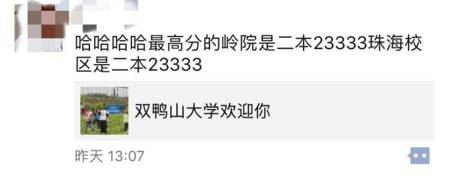
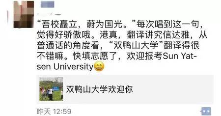

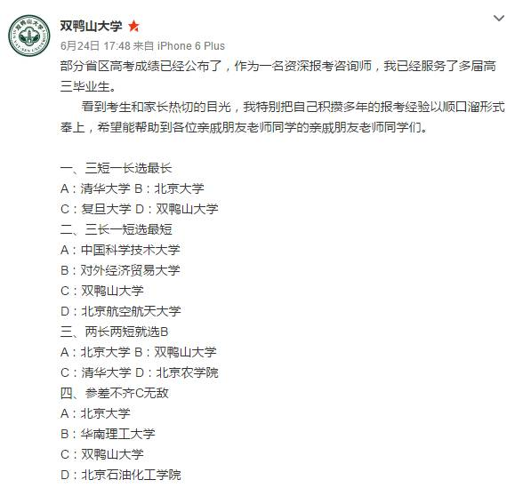

3、双鸭山大学不仅有专属的文化衫，甚至还有微博与贴吧，粉丝数量极其可观，他们的校徽更是火遍网络
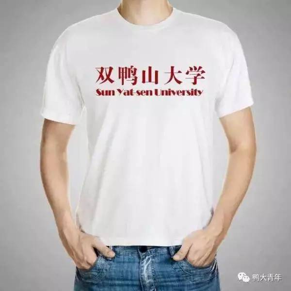
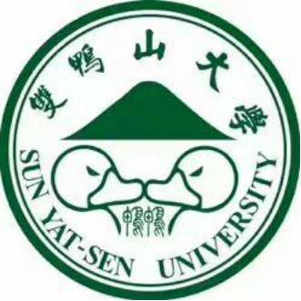
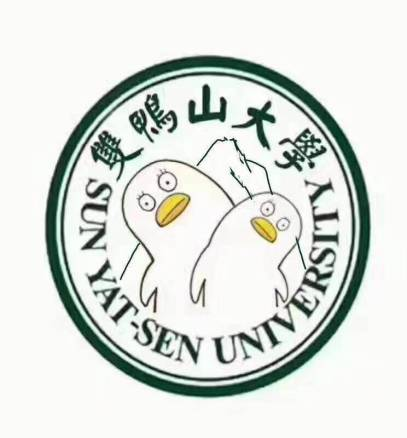
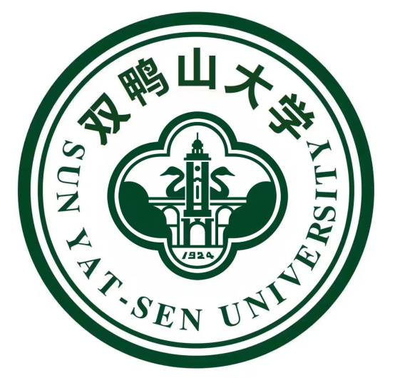
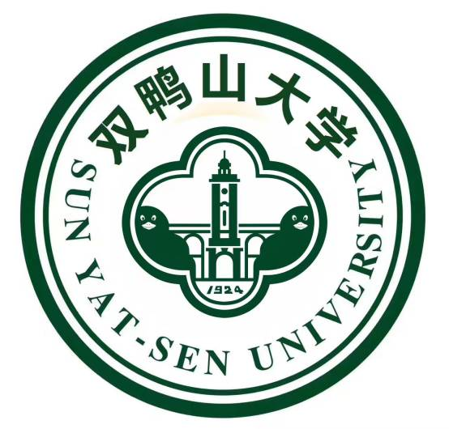

4、其实双鸭山大学是这么来的
作为“双鸭山大学”的原型：中山大学，很多人都不知道中大的英文名是Sun Yat-sen University，中山大学孙中山先生在1924年创办，孙中山原名孙文，号逸仙。Sun Yat-sen是“孙逸仙”的粤语发音的英译，（当时汉语拼音还没被发明出来），沿用至今，被神翻译为“双鸭山大学”。
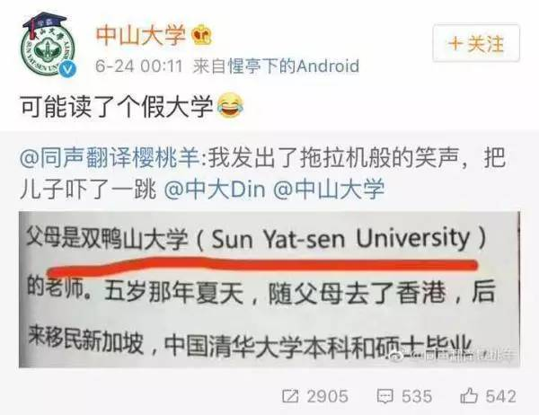
.

截图这段貌似十分装逼的文字来自一本名叫《惊心动魄的17天——独自探秘印占中国藏南地区纪实》的书。
自称是作者的“云湖浪子YZ25T”（张永铭）表示是自己埋的梗。
自己当时在中国藏南地区达旺，参观达旺“县立中学”，校长让他给学生讲几句话。
由于伪造身份，他就编了“双鸭山大学”的身世。
原话是：“1984年出生在中国广东省广州市，父母是双鸭山大学（Sun Yat-sen University）的老师。五岁那年夏天，随父母去了香港，后来全家移民新加坡。中国清华大学本科和硕士毕业，新加坡南洋理工大学博士毕业，现在香港中文大学任助理教授。”“云湖浪子YZ25T”还表示“双鸭山大学”并非错译，而是在自己小圈子里已流传长达五年的一个梗。
五年前他在广州坐地铁，路过“中大”站，方知道中山大学的英文名就是“Sun Yat-sen University”，但听报站音像“双鸭山大学”，他还曾在校内上发照片说：“原来中山大学的英文是....双鸭山大学…” 
但不管怎样，双鸭山大学是火了。
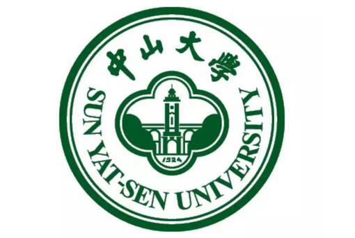

巧的是，黑龙江省真的有个城市叫双鸭山。但中山大学不在中山，也不在南京，以后可能还要加上一句：也不在双鸭山。
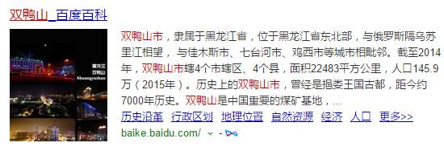

来人啊，孙先生的棺材板快压不住了!!!