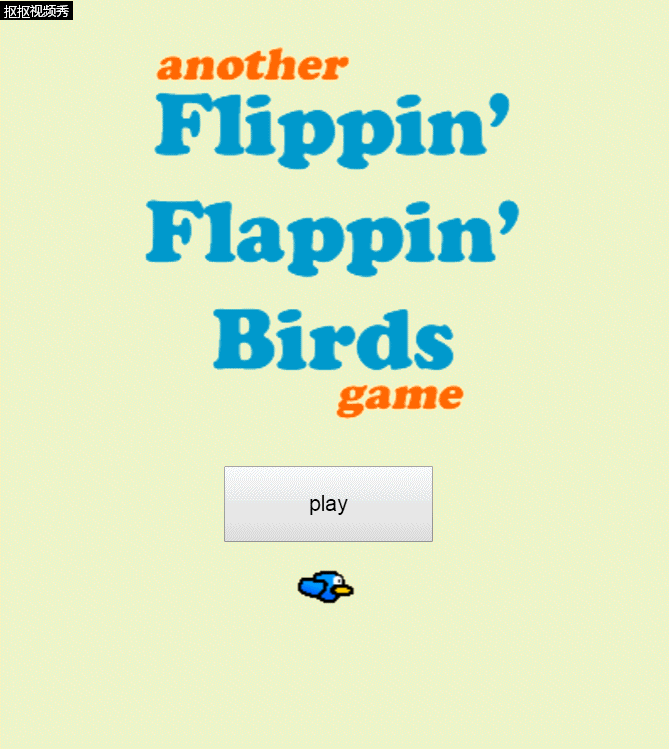

# "flappy bird"游戏制作过程简介
* ## step 1  
创建一个新项目并添加两层 "开始" 和 "游戏"。将这两个图层设置为 "400x500" 的 "布局大小"。  
* ## step 2  
在 "开始" 布局上, 右键单击空白区域并 "插入新对象"。在 "窗体控件" 下双击 "按钮"。将按钮的文本设置为 "播放"。
  
* ## step 3  
转到 "开始" 布局的事件工作表。单击 "添加事件"。双击 "按钮"。单击 "添加操作" 以进行新的 "单击时" 事件。双击 "系统", 然后双击 "转到布局"。选择 "游戏" 布局并按 "确定"。  
* ## step 4
把图片物件拖入布局。  
* ## step 5
我们现在需要给我们的鸟运动。点击鸟, 并在左边的 "行为" 点击 "添加/编辑"。在新的弹出菜单上, 单击左上方的小 "加号" 符号。双击 "平台行为"。在左边, 我们需要改变一个属性的 "平台行为"。将 "最大速度" 设置为 0 (这会阻止您向左和向右移动)。现在右键单击布局, 并 "插入新对象"。在 "输入" 下双击 "鼠标"。这将允许我们听鼠标事件像一个点击!  
* ## step 6  
我们现在需要使背景卷轴给效果的鸟是飞到右边。创建新事件 "系统", 并在 "常规" 下选择 "每刻度"。对于操作, 选择 "管道底部", 并在 "大小 & 位置" 下选择 "设置 X"。键入 "Pipebottom 5"。为 "Pipetop" 和背景楼层对象添加3个相同的操作。这意味着每个刻度, 这些对象将移动到左5像素。 
* ## step 7  
正如你所看到的, 只有一组管道出现过!我们要每秒创建新管道。为此, 请添加一个新事件。选择 "系统", 并在 "时间" 下选择 "每 X 秒"。把这个值设置为 "1.5" (如果你想让它变得更难, 你可以减少它, 如果你希望它更容易的话)
对于操作, 请转到 "系统"、"创建对象" 并选择 "顶部管道"。将 "图层" 设为 "0", 将 "X" 设置为 "400", 并将 Y 设置为 "随机 (50、-250)" (不带引号)。为此事件添加另一个操作, 但创建 "底部管道"。将此管道设置为在 "X = 400" 和 "y = PipeTop 700" 处创建。设置使障碍物随机出现。 
  
*  ## step 8  
 最后，测试游戏。  
 
