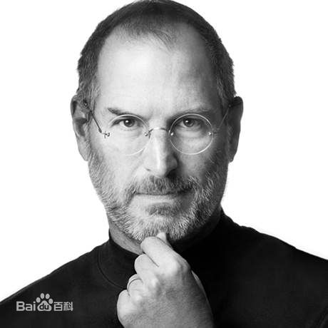

# 创造改变世界的第二个“苹果”——史蒂芬·乔布斯（美国苹果公司联合创始人之一）

* ## 人物简介  

史蒂夫·乔布斯  （Steve Jobs，1955年2月24日—2011年10月5日  ），出生于美国加利福尼亚州旧金山，美国发明家、企业家、美国苹果公司联合创办人。    
1976年4月1日，乔布斯签署了一份合同，决定成立一家电脑公司。  1977年4月，乔布斯在美国第一次计算机展览会展示了苹果Ⅱ号样机。1997年苹果推出iMac，创新的外壳颜色透明设计使得产品大卖，并让苹果度过财政危机。  2011年8月24日，史蒂夫·乔布斯向苹果董事会提交辞职申请。   
乔布斯被认为是计算机业界与娱乐业界的标志性人物，他经历了苹果公司几十年的起落与兴衰，先后领导和推出了麦金塔计算机（Macintosh）、iMac、iPod、iPhone、iPad等风靡全球的电子产品，深刻地改变了现代通讯、娱乐、生活方式。乔布斯同时也是前Pixar动画公司的董事长及行政总裁。  
2011年10月5日，史蒂夫·乔布斯因患胰腺神经内分泌肿瘤  
病逝，享年56岁。

* ## 创业经历  
### 早期发展  
苹果公司成立初期，“苹果“机的生意清淡。1976年7月，一个偶然的机遇给“苹果“公司带来了转机。零售商保罗·特雷尔（Paul Jay Terrell）来到了乔布斯的车库，当看完乔布斯演示完电脑后，决定订购50台整机，这是做成的第一笔生意。
之后“苹果“公司开始了小批量生产。1976年10月，马尔库拉前来拜访沃兹和他们的车库工场。马尔库拉是位电气工程师，擅长推销工作，他主动帮助他们制定一份商业计划，给他们贷款69万美元，有了这笔资金，“苹果“公司的发展速度大大加快了。
1977年4月，乔布斯在美国第一次计算机展览会展示了苹果Ⅱ号样机。
1980年12月12日，苹果公司股票公开上市，在不到一个小时内，460万股全被抢购一空，当日以每股29美元收市。按这个收盘价计算，苹果公司高层产生了4名亿万富翁和40名以上的百万富翁。乔布斯作为公司创办人排名第一。   
1983年，Lisa数据库和Apple Iie发布，售价分别为9998美元和1395美元。但是Lisa的昂贵的售价是没有多少市场的，而Lisa又侵吞了Apple大量研发经费。
由于乔布斯经营理念与当时大多数管理人员不同，加上IBM公司推出个人电脑，抢占大片市场，总经理和董事们便把这一失败归罪于董事长乔布斯，于1985年4月经由董事会决议撤销了他的经营大权。乔布斯几次想夺回权力均未成功，便在1985年9月17日离开苹果公司。   

### 独立时期  
从苹果辞职之后，于1986年乔布斯花1000万美元从乔治·卢卡斯手中收购了Lucasfilm旗下位于加利福尼亚州Emeryville的电脑动画效果工作室，并成立独立公司皮克斯动画工作室。之后该公司成为了众所周知的3D电脑动画公司，并在1995年推出全球首部全3D立体动画电影《玩具总动员》。公司在2006年被迪士尼收购，乔布斯也因此成为迪斯尼最大个人股东。 

### 回归苹果  
1996年苹果公司经营陷入困局，其市场份额也由鼎盛的16%跌到4%。与之相对应的是乔布斯公司由于《玩具总动员》而名声大振，个人身价达到10亿美元。但是乔布斯还是于苹果危难之中重新回来，回来后的乔布斯大刀阔斧改革，停止了不合理的研发和生产，结束了微软和苹果多年的专利纷争，并开始研发新产品iMac和OS X操作系统。 

### 改革时期
1997年苹果推出iMac，创新的外壳颜色透明设计使得产品大卖，并让苹果度过财政危机。

 随后苹果又推出Mac OS X操作系统。
2000年科技股泡沫，乔布斯又提出将PC设计成“数字中枢“先进理念，并先后开发出iTunes和iPod，同时也开始在黄金地段开设专卖店并大获成功。随后Apple TV和iTunes Store等一系列产品受到了市场的好评和认可。
2007年6月29日，苹果公司又推出自有设计的iPhone手机，使用iOS系统，随后发布新一代iPhone 3G以及iPhone 3GS。
2010年6月8日又发布第四代产品iPhone 4，每次上市都引得了世界极大的疯狂和销售热潮。
除了iPhone系列之外，发布使用iOS系统的iPad平板电脑，这一起先不被众人看好的产品，最后获得了巨大的成功。
